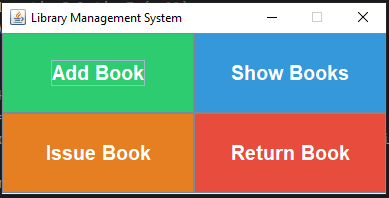
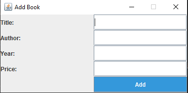
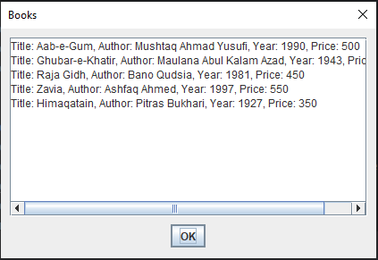
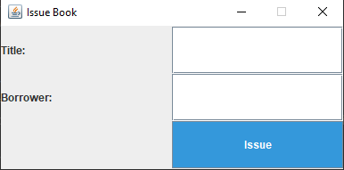
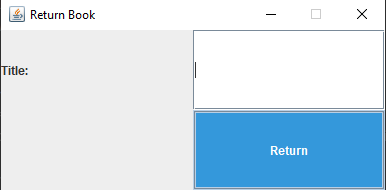

# Library Management System

## Description
The **Library Management System** is a simple application designed to manage books in a library. It allows users to add books, view existing books, issue books, and return books. The system handles files for storing book data and interacts with the user through an intuitive interface.

### Features:
- **Main Screen**: Displays 4 buttons for the core functionalities:
  - **Add Book**: Allows the user to add a new book to the library.
  - **Show Books**: Displays the list of all books in the library.
  - **Issue Book**: Issues a book to a user.
  - **Return Book**: Allows a user to return a book to the library.
  
- **File Handling**: All data is stored and edited in a text file (`books.txt`).
- **Book Management**: The **Show Books** functionality reads from the text file and displays the current collection of books in the library.

## Screens of Project
Below are some screenshots of the Library Management System application in action:

### Main Screen


### Add Book


### Show Books


### Issue Book


### Return Book


## Installation
To set up the Library Management System on your local machine, follow these steps:

1. Clone this repository:
   ```bash
   git clone https://github.com/CodeCraftAli/Library-Management-System.git
2. Navigate to the project directory:
   ```bash
   cd Library-Management-System
3. Open the project in your preferred code editor.
